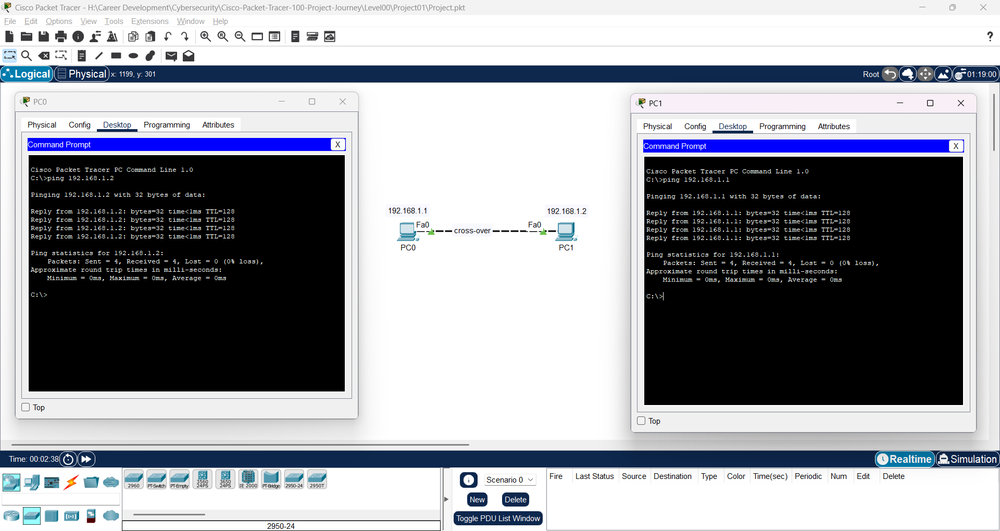

# Project Documentation: Basic PC-to-PC Connectivity

## 1. Overview
**Objective:**  
Establish a direct, peer-to-peer connection between two PCs using Cisco Packet Tracer without the use of switches or routers.  
  
**Scope:**  
- Configure two PCs with static IP addressing in the same subnet.  
- Connect the PCs directly using a crossover cable (or equivalent simulation tool).  
- Verify connectivity using basic network testing tools such as ping.  
- Document the configuration, testing, troubleshooting steps, and lessons learned.

## 2. Network Diagram
*Insert your network diagram image below (e.g., exported from Cisco Packet Tracer, Visio, or any diagramming tool):*

**Diagram Description:**  
- The diagram shows two PCs connected directly by a cable.  
- Each PC is configured with a unique IP address within the same subnet to enable communication.

## 3. Device Configuration
### 3.1 PC 1 Configuration
- **IP Address:** [e.g., 192.168.1.1]
- **Subnet Mask:** [e.g., 255.255.255.0]
- **Default Gateway:** N/A (direct connection)
- **DNS Servers:** N/A (if applicable)
- **Additional Settings:** [Any other settings, if needed]

### 3.2 PC 2 Configuration
- **IP Address:** [e.g., 192.168.1.2]
- **Subnet Mask:** [e.g., 255.255.255.0]
- **Default Gateway:** N/A (direct connection)
- **DNS Servers:** N/A (if applicable)
- **Additional Settings:** [Any other settings, if needed]

## 4. Connectivity Tests
### 4.1 Ping Test Results
- **Test from PC 1 to PC 2:**  
  - *Result:* [e.g., Successful replies received from 192.168.1.2]  
  - *Observations:* [e.g., No packet loss, low latency]
  
- **Test from PC 2 to PC 1:**  
  - *Result:* [e.g., Successful replies received from 192.168.1.1]  
  - *Observations:* [e.g., Connection is stable]

### 4.2 Additional Testing
- **Traceroute (if applicable):**  
  - *Observations:* [Briefly document any additional diagnostic tests and their outcomes.]

## 5. Troubleshooting Steps
- **Issue Encountered:** [Describe any issues that arose during configuration or testing.]  
- **Diagnostic Steps:**  
  - [Step 1: Describe the initial diagnosis, e.g., verifying cable connections in Packet Tracer.]  
  - [Step 2: Document checking IP configurations on both PCs.]  
  - [Step 3: Note any adjustments made or repeated tests to isolate the issue.]  
- **Resolution:** [Describe how the issue was resolved and the final configuration changes made.]

## 6. Lessons Learned
- **Key Takeaways:**  
  - The importance of accurate IP configuration in establishing direct connectivity.
  - Ensuring that both devices are within the same subnet is critical.
- **Challenges Encountered:**  
  - [Describe any challenges, e.g., initial misconfiguration or simulation tool issues.]
- **Recommendations for Future Projects:**  
  - [List any recommendations, such as double-checking cable types or expanding testing methods.]

## 7. Conclusion
The project successfully established a direct PC-to-PC connection without the use of intermediary networking devices. The configuration and testing confirmed that the two PCs could communicate reliably using static IP addresses. This foundational exercise has provided a clear understanding of basic networking principles, which will serve as a stepping stone for more advanced projects.
